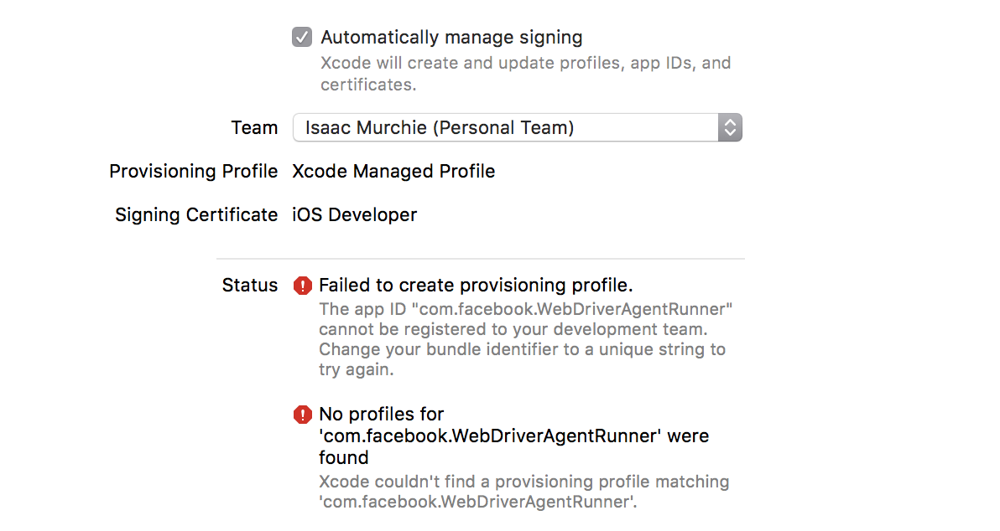

## 目录

- [自动化框架说明](#自动化框架说明)
- [Appium 介绍](#appium)
- [开发案例](#开发)
- [执行测试案例](#执行测试案例)
- [自动安装说明](#自动安装说明)
- [启动Appium](启动Appium)
- [xcode配置](#xcode配置)
- [替换chromedriver](#替换chromedriver)


##  scan

# 自动化框架说明

1.  本项目是基于 [appium](http://appium.io/) 自动化测试框搭建,基于 [webdriver](http://webdriver.io) 交互协议实现与移动端通信.
2.  测试案例用的JavaScript 的 [mocha](https://mochajs.org/) 测试框架编写
3.  测试断言语法基于 [chai](http://chaijs.com/) 的 should 语法结构.
4.  MAC 下需要首先安装好Xcode 和 NodeJS
5.  windows 下需要安装好JDK,Android Studio,Maven.

##  Appium
 1. Appium 是基于 C/S 机构移动测试框架.

 2. Appium 的核心是一个 web 服务器，它提供了一套 REST 的接口。它收到客户端的连接，监听到命令，接着在移动设备上执行这些命令，然后将执行结果放在 HTTP响应中返还给客户端

3.  Appium 之所以能在Android 和 IOS上跑测试案例,是因为appium 内置测试引擎是苹果和安卓的官方测试框架

*   iOS: 苹果的 UIAutomation
*    Android 4.3+: Google 的 UiAutomator
*   Android 2.3+: Google 的 Instrumentation. (Instrumentation由单独的项目Selendroid提供支持 )

4.  开发人员编写的测试案例就是 C/S 中的Client .其中我们的Client 就是 WebDriver 实例,它内部实现了Http 请求协议.(详见下面的测试案例说明)

## 开发

步骤如下:

1.  [开启appium服务](启动Appium)
2.  手动配置文件. 如果要在IOS上测试案例的话,需要修改 xcode.org.json 里面的xcodeOrgId 值需要[xcode帮助配置里面找到](#IOS配置). 如果再测试过程中需要修对案例做统一的操作,可以在mocha.config.js 修改对应的内容(即hooks).
3.  开发测试案例. 所有的测试案例都放在 cases/目录下.案例必须是js文件,且都是以node module 方式导出函数.

4.  测试案例书写规范


    client :  webdriver 实例, 采用统一的命名规范.

测试案例文件如下:
```javascript

    module.exports=function (client) { //所有测试案例都以模块方式导出,client 作为全局唯一参数传入
            describe('----- context',function () {
                it('should list 3 contexts',function () {
                     return client.contexts().then(function (result) {
                        console.log(result)
                        return client.context(result.value[result.value.length - 1]);
                        // console.log()
                    })
                    .getText('.case-box', 3000)
                    .then(function(text){
                        // console.log(text)
                        text.should.be.equal('这里是案例的内容区')
                        // return client.quit();
                        // console.log(client.getSource())
                    })
                    .getText('.container', 3000)
                    .then(function(text){
                        // console.log(text)
                        text.should.be.equal('这里是案例的内容区')
                        // return client.quit();
                        // console.log(client.getSource())
                    })
            })
        })
    }

```


 相关开发文档参考
 1. API: [webdriver文档参考链接](http://webdriver.io/api.html)
 2. Mocha: [测试框架`Mocha`语法](https://mochajs.org/)
 3. 测试编写语法: [断言语法(推荐用`should`,当前项目使用should)](http://chaijs.com/)

## 执行测试案例

    npm run mocha [file] [target]

#####  参数说明:

*   file  : 测试案例文件名,若指定文件则执行指定的测试案例,若不指定则运行全部测试案例

*   target: 测试设备的操作系统,可选系统为 android 或者 ios

1. npm run mocha    在已连接的设备上运行cases/所有测试案例
2. npm run mocha mod.js 在已经连接的设备上运行cases/ 指定的文件(mod.js)
3. npm run mocha ios 在IOS设备上运行cases/ 所有的测试案例
4. npm run mocha mod.js ios 在IOS设备上运行cases/ 指定的文件(mod.js)


## 自动安装说明
1.  mac 版支持自动化安装程序所依赖的库和软件包
2.  windows 版由于需要手动设置环境变量和下载Android 相关软件包,所以设计成半自动化,不能自动执行的任务将以"提示"方式出现,指导安装过程

 *  初次下载此项目之后,直接运行如下命令:
```
    npm run init
```
 *  [替换chromeDriver](#替换chromedriver)
 *  自动安装过程中有些文件需要手动配置手动配置,[下面详细介绍](#MAC环境手动配置内容)


##  启动Appium

终端运行如下命令

    appium

终端出现如下内容则为成功

    [Appium] Welcome to Appium v1.6.5 (REV 4174bf147c50dc09b46820562a77ce2522020504)
    [Appium] Appium REST http interface listener started on 0.0.0.0:4723


# MAC环境手动配置内容

##  xcode配置
在mac 下自动安装Appium过程中,需要配置appium里面的 WebDriverAgent.xcodeproj,正常情况下此文件会自动打开,如果不是的话,请到 全局环境的node_modules 下找到 WebDriverAgent.xcodeproj,相对于全局的node_modules/appium/node_modules/_appium-xcuitest-driver@2.43.2@appium-xcuitest-driver/WebDriverAgent路径里.
*   首先将手机连上MAC本,如果首次连接的话手机里会弹出是否信任此电脑,请选择信任,然后继续

*   Xcode打开 WebDriverAgent.xcodeproj 之后,首先要登录自己的appleID 在Xcode 导航栏里  Xcode->Preferences -> Account 或者快捷键 "command + ," 如下图:


* Xcode 的运行测试设备 target 上选择 自己的手机如下图


*  在 WebDriverAgentLib 和WebDriverAgentRunner (**切记两个都需要设置**)的General 面板上 选择 Automatically manage signing, Team 下拉选择框上选择自己的Development Team .
如下图


*   在配置WebDriverAgentRunner 时候,Xcode 创建provisioning profile 可能会失败如下图:



*   出现这种情况的时候需要打开 Build Settings 面板,把 Product Bundle Identifier 设置为 com.gome.webX(X=1,2....)
如下图


*   还是在Build Settings 面板,在Code Sign id 选项里 选中Debug 下的值,然后选择 other 设置为iPhone Developer 如下图:


再返回到General 面板,这时候你看到的应该就是成功的了,如下图


3.  以上内容都配置完之后,在WebDriverAgent目录下,终端里执行如下命令

```
xcodebuild -project WebDriverAgent.xcodeproj -scheme WebDriverAgentRunner -destination 'id=<测试机的udid>' test
```

出现以下结果则是成功:
```
Test Suite 'All tests' started at 2017-01-23 15:49:12.585
    Test Suite 'WebDriverAgentRunner.xctest' started at 2017-01-23 15:49:12.586
    Test Suite 'UITestingUITests' started at 2017-01-23 15:49:12.587
    Test Case '-[UITestingUITests testRunner]' started.
        t =     0.00s     Start Test at 2017-01-23 15:49:12.588
        t =     0.00s     Set Up
```

如果没有出现如上结果,查看自己的测试机  设置->通用->设备管理->开发者应用下找到你的AppleID -> 信任 WebDriverAgentRunner 即可

## 替换chromedriver

1.  mac 测试需要将 appium 所安装目录里的/node_modules/appium-chromedriver/chromedriver/mac/chromedriver 替换掉.

首先下载替换chromedriver 的内容

```
git@git.yunshipei.com:heng.yang/chromedriver.git
```
将下载下来的内容全部拷贝到 appium 所安装目录里的/node_modules/appium-chromedriver/chromedriver/mac/

覆盖掉即可.